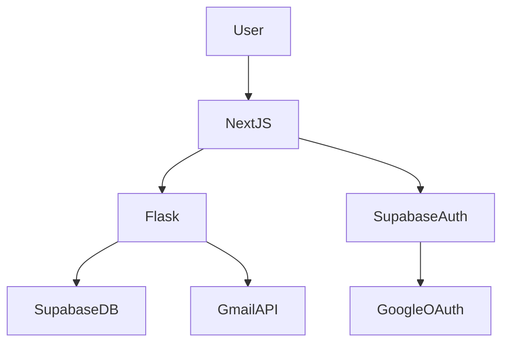

# Task Management Application

## Overview
A complete, working, production-ready Task Management Web Application for a Full Stack Development Internship assignment.

## Features
- Create accounts and login using Google OAuth 2.0.
- Create, manage, and delete tasks.
- Assign tasks to other registered users.
- Email notifications via Gmail API for task creation and completion.
- Supabase PostgreSQL for database storage.
- Python Flask backend REST API.
- Next.js frontend with Tailwind CSS.

## Architecture

The authentication is handled entirely by Supabase with Google as the OAuth provider. The frontend retrieves the Supabase JWT and passes it as a Bearer token to the Flask API. The backend uses the Supabase service role key to securely interact with the database and verify tokens.

### Repositories
- **Frontend**: Next.js App Router (TypeScript, React, Tailwind CSS)
- **Backend**: Flask (Python, REST API, Gmail Integration)

### Database Schema
- **profiles**: id (UUID), email, full_name, avatar_url, created_at, updated_at
- **tasks**: id (UUID), title, description, status (pending, in_progress, completed), priority (low, medium, high), created_by (fk), assigned_to (fk), due_date, created_at, updated_at, completed_at

## Deployment
- **Frontend**: Vercel
- **Backend**: Railway / Render
- **Database**: Supabase
