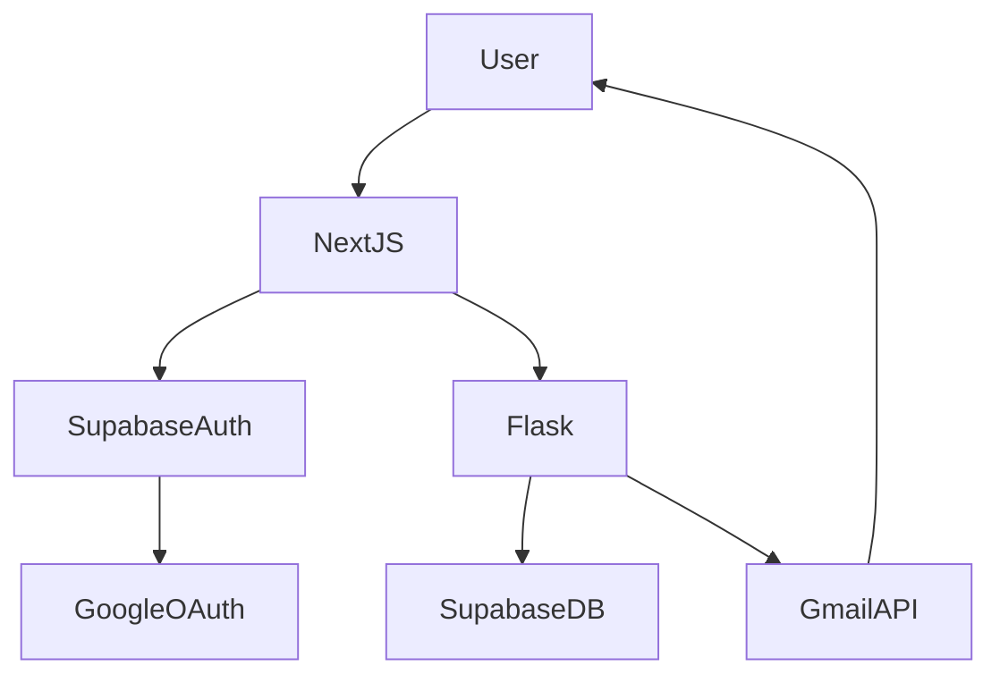

# Task Management Application

## 1. Project Overview
A complete, production-ready Task Management Web Application built for a Full Stack Development Internship assignment. It allows users to authenticate with Google, create tasks, assign them to other users, and receive email notifications when tasks are assigned or completed.

## 2. Features
- Create accounts and login using Google OAuth 2.0.
- Create, manage, and delete tasks.
- Assign tasks to other registered users.
- Email notifications via Gmail API for task creation and completion.
- Secure, token-based authentication.
- Responsive, modern user interface.

## 3. Technology Stack
- **Frontend**: Next.js (App Router), TypeScript, Tailwind CSS
- **Backend**: Flask (Python), REST API
- **Database & Auth**: Supabase (PostgreSQL, GoTrue)
- **Email Service**: Gmail API (Google Cloud Platform)
- **Deployment**: Vercel (Frontend), Render (Backend)

## 4. Architecture



The frontend uses Next.js to provide a fast, responsive UI. Authentication is handled directly between the frontend and Supabase Auth. The frontend then sends the authenticated JWT access token to the Flask backend. The backend verifies the token directly using the Supabase SDK, ensuring requests are legitimate. It then interfaces with the Supabase Database and triggers the Gmail API asynchronously for notifications.

## 5. Frontend Structure
The frontend resides in the `frontend/` directory and follows standard Next.js conventions:
- `src/app`: Page routing (dashboard, login, create task).
- `src/components`: Reusable UI components (Navbar, TaskCard).
- `src/lib`: API clients and Supabase initialization.
- `src/types`: TypeScript interfaces for shared models.

## 6. Backend Structure
The backend resides in the `backend/` directory:
- `app/`: Main application package.
- `app/auth/`: Middleware for JWT verification.
- `app/tasks/`: Task CRUD routes.
- `app/users/`: User listing and search routes.
- `app/notifications/`: Gmail API integration and asynchronous email dispatch.

## 7. Supabase Database
The database consists of two main tables:
- **`profiles`**: Synchronizes automatically with Supabase Auth via triggers. Stores `id` (UUID), `email`, and `full_name`.
- **`tasks`**: Stores task data, linking to profiles via `created_by` and `assigned_to` foreign keys.

## 8. Google OAuth Flow
1. User clicks "Login with Google" on the frontend.
2. Supabase redirects the user to the Google OAuth consent screen.
3. Upon successful login, Supabase provisions an Auth user and fires a trigger to create a `profiles` record.
4. The frontend receives a session with an access token.
5. The frontend calls `POST /api/auth/sync` on the backend to double-check the profile synchronization.

## 9. Task Creation Flow
1. User fills out the task form.
2. Frontend sends `POST /api/tasks` with the task payload and Bearer token.
3. Backend verifies the token using `supabase.auth.get_user()`.
4. Backend inserts the task into the database.
5. Backend fetches the assignee's email.
6. Backend asynchronously triggers the Gmail API to send a "New Task" notification.

## 10. Task Assignment Flow
- The frontend fetches a list of registered users via `GET /api/users`.
- The user selects an assignee from a dropdown list (defaulting to themselves).
- The `assigned_to` UUID is sent to the backend and stored in the database.
- A user cannot assign a task to a non-existent user because the backend validates the ID against the `profiles` table.

## 11. Gmail Notification Flow
- Gmail integration uses a dedicated Google Cloud Service Account/OAuth Client.
- The `GMAIL_REFRESH_TOKEN` allows the backend to generate access tokens without manual intervention.
- The `app/notifications/service.py` runs email sending in a background thread to prevent blocking the API response.

## 12. Task Completion Flow
1. User clicks "Mark Complete" on a task.
2. Frontend sends `POST /api/tasks/<id>/complete`.
3. Backend marks the task `status` as `completed` and sets `completed_at`.
4. Backend fetches the task creator's email.
5. An asynchronous email notification is sent to the creator.

## 13. Environment Variables

### Frontend (`frontend/.env.example`)
```env
NEXT_PUBLIC_SUPABASE_URL=your-supabase-project-url
NEXT_PUBLIC_SUPABASE_ANON_KEY=your-supabase-anon-key
NEXT_PUBLIC_API_URL=http://localhost:5000/api
```

### Backend (`backend/.env.example`)
```env
SUPABASE_URL=your-supabase-project-url
SUPABASE_SERVICE_ROLE_KEY=your-supabase-service-role-key
GOOGLE_CLIENT_ID=your-google-oauth-client-id
GOOGLE_CLIENT_SECRET=your-google-oauth-client-secret
GMAIL_CLIENT_ID=your-gmail-api-client-id
GMAIL_CLIENT_SECRET=your-gmail-api-client-secret
GMAIL_REFRESH_TOKEN=your-gmail-api-refresh-token
GMAIL_SENDER_EMAIL=your-sender-email-address
FRONTEND_URL=http://localhost:3000
```

## 14. Local Development Setup

### Frontend
```bash
cd frontend
npm install
npm run dev
```

### Backend
```bash
cd backend
python -m venv venv
source venv/bin/activate  # (or venv\Scripts\activate on Windows)
pip install -r requirements.txt
flask run
```

## 15. Database Migrations
Migrations are stored in the `/migrations` folder. They define the schema for `profiles`, `tasks`, and the Supabase Auth triggers.
To run, execute the SQL directly in the Supabase SQL Editor.

## 16. Deployment
- **Frontend**: Automatically deployed via Vercel on push to the `main` branch.
- **Backend**: Deployed on Render using Gunicorn.
- Both deployments require the environment variables to be set in their respective dashboards.

## 17. API Overview
- `GET /api/users`: List users for assignment.
- `GET /api/tasks`: List tasks.
- `POST /api/tasks`: Create a new task.
- `PATCH /api/tasks/<id>`: Update a task.
- `POST /api/tasks/<id>/complete`: Mark task complete.
- `DELETE /api/tasks/<id>`: Delete a task.
- `POST /api/auth/sync`: Sync profile on login.

## 18. Security Considerations
- **No secrets in frontend**: Service role keys and Gmail tokens are kept strictly in the backend environment.
- **Token verification**: Every protected API route verifies the Supabase access token via the official Supabase SDK.
- **Data isolation**: Tasks are restricted so users can only modify tasks they created or were assigned.
- **Environment files ignored**: All `.env` files are tracked in `.gitignore`.
